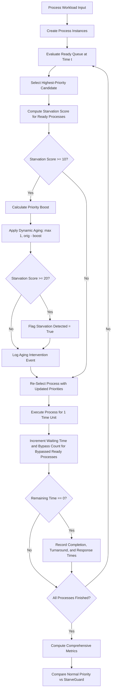

# StarveGuard

### Adaptive Process Starvation Detection and Aging-Based Prevention System

StarveGuard is an Operating Systems CPU scheduling research prototype designed to address process starvation in preemptive priority-based scheduling. The system continuously evaluates running and waiting processes using a dual-factor starvation scoring model, dynamically applies multi-tier priority aging to prevent indefinite postponement, and benchmarks performance against standard priority scheduling across fairness, turnaround, waiting, and response metrics.

---

## Overview

In traditional priority-based CPU scheduling, the scheduler always grants the processor to the ready process with the highest priority (represented in this project by the lowest numerical priority value). While effective for prioritizing urgent or interactive tasks, this design suffers from a fundamental vulnerability: **starvation** (indefinite postponement). When a continuous stream of higher-priority processes enters the ready queue, lower-priority processes remain perpetually stranded without execution time.

StarveGuard implements an adaptive scheduling layer that actively mitigates starvation while preserving priority differentiation:

- **Waiting Time Tracking:** Measures the exact duration each process spends in the ready queue.
- **Bypass Count Tracking:** Records each scheduling instance where a ready process is passed over in favor of another process.
- **Dual-Factor Starvation Scoring:** Combines waiting time with weighted bypass frequency into a unified starvation metric.
- **Threshold-Based Starvation Detection:** Flags processes that cross defined starvation tolerances.
- **Adaptive Multi-Tier Aging:** Dynamically boosts process priority based on starvation severity and re-evaluates the scheduling decision at each discrete time step.
- **Comparative Evaluation:** Benchmarks StarveGuard directly against unmitigated priority scheduling using identical workload inputs.

---

## Key Features

- **Preemptive Priority Scheduler:** Time-sliced scheduling engine executing at discrete time increments with dynamic re-selection.
- **Dual-Factor Starvation Detection:** Combines cumulative waiting time and scheduling bypass count to identify both idle and heavily contested starvation.
- **Adaptive Priority Aging:** Multi-stage priority escalation that scales proportionally with the calculated starvation score.
- **Baseline vs. Adaptive Comparator:** `SchedulerComparator` interface running identical process queues through both scheduling regimes for controlled comparisons.
- **Comprehensive Performance Metrics:** Evaluates Average Waiting Time, Average Turnaround Time, Average Response Time, Maximum Waiting Time, and Jain's Fairness Index.
- **Execution Gantt Charts:** Generates segmented visual timelines with exact start/completion markers, proportional block widths, and idle CPU handling.
- **Process-Level Audit Table:** Tracks PID, arrival, burst, original priority, final priority, completion time, response time, turnaround time, bypass count, aging adjustments, and starvation flags.
- **Aging Intervention Event Log:** Records timestamped priority transitions with previous priority, updated priority, and triggering starvation scores.
- **Desktop Graphical Interface:** Built with Tkinter and ttk, featuring interactive workload inputs, keyboard navigation, embedded metrics dashboards, and Gantt charts.
- **CLI Execution Engine:** Interactive terminal interface (`main.py`) for scriptable headless execution and text-based ASCII Gantt visualization.
- **Experimental Benchmark Suite:** Built-in test suite evaluating multiple workload patterns (starvation-heavy, mixed arrivals, heavy CPU bursts, sequential execution) with CSV exports and Matplotlib graphs.

---

## Why Starvation Happens

Priority scheduling algorithms execute processes strictly according to assigned priority levels. If lower numerical values denote higher priority, a process with priority 6 will not execute as long as any process with priority $\le 5$ is ready.

Consider a representative scenario:

| Process | Arrival Time | Burst Time | Priority (Lower = Higher) |
| :---: | :---: | :---: | :---: |
| **P1** | 0 | 15 | 6 (Low Priority) |
| **P2** | 0 | 5 | 3 (High Priority) |
| **P3** | 5 | 5 | 3 (High Priority) |
| **P4** | 10 | 5 | 3 (High Priority) |

Under standard preemptive priority scheduling:

1. At time $t = 0$, both P1 and P2 arrive. P2 (priority 3) is selected over P1 (priority 6).
2. At time $t = 5$, P2 finishes. However, P3 arrives with priority 3, immediately capturing the CPU.
3. At time $t = 10$, P3 finishes. P4 arrives with priority 3, once again preempting P1.
4. P1 remains blocked until $t = 15$, having been bypassed by three successive higher-priority jobs despite arriving at $t = 0$.

If higher-priority processes arrive continuously, P1 will experience indefinite postponement, resulting in severe response-time degradation and reduced system fairness.

---

## How StarveGuard Works

StarveGuard inserts a starvation evaluation and aging layer directly into the scheduling loop:



### Execution Lifecycle

1. **Ready Queue Polling:** At discrete time $t$, identify all processes with `arrival_time <= t` and `remaining_time > 0`.
2. **Initial Candidate Selection:** Identify the highest-priority process using the tuple `(current_priority, arrival_time, pid)`.
3. **Starvation Evaluation:** Calculate the starvation score for every process currently waiting in the ready queue.
4. **Adaptive Priority Aging:** For processes with a starvation score $\ge 10$, apply a graduated priority boost relative to the original priority. If the score reaches or exceeds 20, set the `starvation_detected` flag. Record any priority modification to the aging intervention log.
5. **Dynamic Process Re-selection:** Re-evaluate the ready queue using updated priorities so that aged processes can immediately compete for the CPU.
6. **Execution Step:** Execute the selected process for one time unit (`remaining_time = remaining_time - 1`, `time = time + 1`).
7. **State Tracking:** Increment `waiting_time` and `bypass_count` for all ready processes that were not selected during this time unit.
8. **Completion Handling:** When a process completes, record its completion time, turnaround time, and response time.

---

## Starvation Detection

StarveGuard calculates a continuous starvation metric rather than relying exclusively on elapsed time.

### Starvation Score Formula

$$\text{Starvation Score} = \text{Waiting Time} + (\text{Bypass Count} \times \text{Bypass Weight})$$

### Configured Constants

| Parameter | Value | Location in Source Code |
| :--- | :---: | :--- |
| **Starvation Threshold** | `20` | `starvation/detector.py` (`StarvationDetector.threshold`) |
| **Bypass Weight** | `2` | `starvation/detector.py` (`StarvationDetector.bypass_weight`) |

### Terminology

- **Waiting Time:** Total discrete time units spent in the ready queue while ready for execution.
- **Bypass Count:** The total number of scheduling decisions where a process was ready in the queue, but another process was chosen instead.
- **Starvation Detected:** A binary flag set to `True` when a process's starvation score reaches or exceeds the starvation threshold of `20`.

---

## Adaptive Aging

When a process experiences elevated starvation scores, StarveGuard temporarily improves its priority to allow CPU access.

### Priority Boost Policy

| Starvation Score Range | Priority Boost | Effective Priority Calculation |
| :---: | :---: | :--- |
| **0 – 9** | `0` | `current = original_priority` |
| **10 – 19** | `1` | `current = max(1, original_priority - 1)` |
| **20 – 29** | `2` | `current = max(1, original_priority - 2)` |
| **30+** | `3` | `current = max(1, original_priority - 3)` |

### Aging Rules

- **Priority Convention:** Lower numerical values denote higher priority (priority 1 is the highest possible priority).
- **Aging Direction:** Aging subtracts the boost value from the process's numerical priority, increasing its scheduling urgency.
- **Priority Floor:** The effective priority cannot be reduced below `1` (`max(1, original_priority - boost)`).
- **Baseline Anchoring:** Boosts are applied relative to `original_priority`, preventing cumulative runaway priority inflation.
- **Intervention Logging:** Every priority adjustment increments `process.aging_adjustments` and appends an entry `(time, pid, old_priority, new_priority, score)` to `scheduler.aging_events`.
- **Protected Process:** Any process whose priority was improved by the aging manager at least once (`aging_adjustments > 0`).

---

## Scheduling Models Comparison

| Architecture Component | Normal Priority Scheduler | StarveGuard Priority Scheduler |
| :--- | :---: | :---: |
| **Module** | `scheduler.normal_priority_scheduler` | `scheduler.priority_scheduler` |
| **Preemption** | Yes (per discrete time unit) | Yes (per discrete time unit) |
| **Tie Breaking** | `arrival_time`, then `pid` | `arrival_time`, then `pid` |
| **Priority Assignment** | Static (Unchanged throughout execution) | Dynamic (Adjusted via adaptive aging) |
| **Bypass Tracking** | No | Yes (`p.bypass_count`) |
| **Starvation Scoring** | No | Yes (`StarvationDetector.calculate_score`) |
| **Starvation Flagging** | No | Yes (`p.starvation_detected` when score $\ge 20$) |
| **Aging Mechanism** | None | Multi-tier boost based on score tiers |
| **Process Re-selection** | Once per cycle | Re-evaluated after aging updates |
| **Aging Event Auditing** | None | Logged with time, PID, old/new priority, and score |
| **Fairness Evaluation** | Measured post-simulation | Measured post-simulation |

---

## Metrics

StarveGuard calculates performance and fairness metrics through `metrics/calculator.py`:

### Aggregate Metrics

- **Average Waiting Time:** Mean duration processes spent waiting in the ready queue:
  $$\text{Average Waiting Time} = \frac{1}{n} \sum_{i=1}^n WT_i$$
- **Average Turnaround Time:** Mean total time elapsed from process arrival to final completion:
  $$\text{Average Turnaround Time} = \frac{1}{n} \sum_{i=1}^n TAT_i$$
- **Average Response Time:** Mean time from arrival to first CPU allocation:
  $$\text{Average Response Time} = \frac{1}{n} \sum_{i=1}^n RT_i$$
- **Maximum Waiting Time:** Peak waiting time observed across all processes:
  $$\text{Maximum Waiting Time} = \max_{1 \le i \le n}(WT_i)$$
- **Jain's Fairness Index:** Measures system throughput fairness based on process service efficiency:
  $$J(x_1, x_2, \dots, x_n) = \frac{\left( \sum_{i=1}^n x_i \right)^2}{n \cdot \sum_{i=1}^n x_i^2}, \quad \text{where } x_i = \frac{\text{Burst}_i}{\text{Turnaround}_i}$$
  A score of $1.0$ represents optimal fairness, while lower scores indicate disproportionate resource starvation.
- **Starved Processes Count:** Number of processes where $\text{Starvation Score} \ge 20$.
- **Protected Processes Count:** Number of processes that received at least one aging priority adjustment.
- **Aging Interventions Count:** Total number of priority adjustment events recorded during execution.

### Process-Level Metrics

- **Completion Time ($C_i$):** Discrete time unit at which the process finishes its total burst.
- **Turnaround Time ($TAT_i$):** Total elapsed lifecycle time: $TAT_i = C_i - \text{Arrival}_i$.
- **Waiting Time ($WT_i$):** Total time spent waiting in the ready queue: $WT_i = TAT_i - \text{Burst}_i$.
- **Response Time ($RT_i$):** Time elapsed between arrival and initial CPU acquisition: $RT_i = \text{FirstRun}_i - \text{Arrival}_i$.
- **Bypass Count:** Number of times the process was ready but another process was scheduled.
- **Aging Adjustments:** Number of priority boost interventions applied to the process.
- **Original Priority:** Static priority assigned upon creation.
- **Final Priority:** Effective priority at the conclusion of execution.

---

## Project Architecture

```
StarveGuard/
├── aging/
│   ├── __init__.py
│   └── aging_manager.py           # Multi-tier priority boost and aging calculation
├── comparison/
│   ├── __init__.py
│   └── comparator.py              # Comparative execution harness (Normal vs StarveGuard)
├── metrics/
│   ├── __init__.py
│   └── calculator.py              # Performance metrics and Jain's Fairness Index
├── results/
│   ├── average_response_comparison.png  # Workload response time comparison chart
│   ├── average_waiting_comparison.png   # Workload waiting time comparison chart
│   ├── experiment_results.txt           # Formatted benchmark evaluation report
│   ├── fairness_comparison.png          # Workload fairness comparison chart
│   ├── generate_graphs.py               # Matplotlib script generating benchmark figures
│   ├── summary.py                       # Summary reporting utility
│   └── workload_results.csv             # Structured CSV dataset from workload evaluation
├── scheduler/
│   ├── __init__.py
│   ├── gantt.py                   # Terminal ASCII Gantt chart renderer
│   ├── normal_priority_scheduler.py # Baseline preemptive priority scheduler
│   ├── priority_scheduler.py      # StarveGuard adaptive preemptive priority scheduler
│   └── process.py                 # Process dataclass and execution state tracking
├── starvation/
│   ├── __init__.py
│   └── detector.py                # Starvation score calculation and threshold validation
├── tests/
│   ├── test_aging.py              # Tests for AgingManager boost logic
│   ├── test_aging_prevention.py   # Tests for starvation prevention mechanics
│   ├── test_comparison.py         # Tests for comparative evaluation
│   ├── test_demo.py               # Script verifying demo workload execution
│   ├── test_detector.py           # Tests for StarvationDetector score calculations
│   ├── test_metrics.py            # Tests for MetricsCalculator
│   ├── test_normal_priority.py    # Baseline priority scheduler verification
│   ├── test_process.py            # Process dataclass initialization tests
│   ├── test_scheduler.py          # Adaptive scheduler integration tests
│   ├── test_starvation.py         # Starvation scenario validation
│   └── test_workloads.py          # 4-workload evaluation suite writing to CSV
├── ui/
│   └── app.py                     # Tkinter desktop graphical user interface
├── main.py                        # Interactive command-line application
└── README.md                      # Project documentation
```

### Module Responsibilities

| Module | Primary Responsibility |
| :--- | :--- |
| `scheduler/process.py` | Holds process attributes, state counters, and lifecycle timestamps. |
| `scheduler/normal_priority_scheduler.py` | Implements baseline preemptive priority scheduling without starvation handling. |
| `scheduler/priority_scheduler.py` | Implements StarveGuard preemptive scheduling with integrated detection and aging. |
| `scheduler/gantt.py` | Renders ASCII Gantt timeline blocks for CLI executions. |
| `starvation/detector.py` | Computes starvation scores and flags starving processes against threshold limits. |
| `aging/aging_manager.py` | Maps starvation scores to priority boost increments and enforces priority boundaries. |
| `metrics/calculator.py` | Computes statistical metrics and Jain's Fairness Index across process sets. |
| `comparison/comparator.py` | Orchestrates dual simulation runs on identical process queues. |
| `results/` | Houses pre-generated evaluation artifacts, CSV data logs, and chart generation tools. |
| `ui/app.py` | Full-featured desktop GUI providing interactive controls, Gantt charts, and metrics displays. |
| `main.py` | Terminal interface for entering workloads and reviewing text-based simulation reports. |

---

## Graphical Interface

The desktop application (`ui/app.py`) is implemented using Python's standard `tkinter` and `ttk` libraries.

```
+---------------------------------------------------------------------------------------------------+
|                                            STARVEGUARD                                            |
|                    Adaptive Process Starvation Detection and Prevention System                    |
+---------------------------------------------------------------------------------------------------+
|  PROCESS INPUTS & EXECUTION CONTROLS                                                              |
|  Process    Arrival Time    Burst Time    Priority                                                |
|  P1         [    0     ]    [    15   ]   [   6    ]                                              |
|  P2         [    0     ]    [     5   ]   [   3    ]                                              |
|  P3         [    5     ]    [     5   ]   [   3    ]                                              |
|  P4         [    10    ]    [     5   ]   [   3    ]                                              |
|  [> Run Simulation]   [! Load Demo Workload]   [Clear / Reset]                                    |
+---------------------------------------------------------------------------------------------------+
|  NORMAL PRIORITY METRICS     |  STARVEGUARD ADAPTIVE METRICS    |  COMPARISON (STARVEGUARD - NORMAL)  |
|  Average Waiting:      3.75  |  Average Waiting:          4.75  |  Average Waiting Change:     +1.00  |
|  Average Turnaround:  11.25  |  Average Turnaround:      12.25  |  Average Turnaround Change:  +1.00  |
|  Average Response:     3.75  |  Average Response:         3.50  |  Average Response Change:    -0.25  |
|  Maximum Waiting:        15  |  Maximum Waiting:            15  |  Maximum Waiting Change:         0  |
|  Fairness:            0.942  |  Fairness:                0.912  |  Fairness Change:           -0.030  |
|                              |  Starved Processes:           1  |                                     |
|                              |  Protected Processes:         2  |                                     |
|                              |  Aging Interventions:         4  |                                     |
+---------------------------------------------------------------------------------------------------+
|  METRIC DEFINITIONS                                                                               |
|  * Starvation Detected: Score >= threshold (20)   * Protected Process: Priority improved by aging |
|  * Aging Intervention: One priority adjustment   * Starvation Score: Waiting + (Bypass x 2)      |
|  * Priority: Lower numerical value = higher priority                                              |
+---------------------------------------------------------------------------------------------------+
|  SCHEDULING TIMELINE (GANTT CHARTS)                                                               |
|  Normal Priority Timeline:                                                                        |
|  [      P2      ][      P3      ][      P4      ][                      P1                      ] |
|  0               5               10              15                                             30|
|  StarveGuard Adaptive Timeline:                                                                   |
|  [      P2      ][      P3      ][      P1      ][      P4      ][              P1              ] |
|  0               5               10              14              19                             30|
|  Legend: [P1] [P2] [P3] [P4] [IDLE]                                                               |
+---------------------------------------------------------------------------------------------------+
|  STARVEGUARD PROCESS-LEVEL METRICS               |  STARVEGUARD AGING INTERVENTION EVENTS          |
|  PID Arr Bst Orig Final Comp Wait TAT Resp Byp … |  Time  Process  Old Prio  New Prio  Starv Score |
|  P1   0   15  6     3    30   15   30  10   15 … |  4     P1       6         5         12        |
|  P2   0   5   3     3    5    0    5   0    0  … |  7     P1       5         4         21        |
|  P3   5   5   3     3    10   0    5   0    0  … |  10    P1       4         3         30        |
|  P4   10  5   3     2    19   4    9   4    4  … |  14    P4       3         2         12        |
+---------------------------------------------------------------------------------------------------+
|  EXPERIMENTAL ANALYSIS (PRE-GENERATED BENCHMARK GRAPHS)                                           |
|  [Show Waiting Time Graph]       [Show Response Time Graph]       [Show Fairness Graph]           |
+---------------------------------------------------------------------------------------------------+
| Ready / Simulation completed successfully. Visual dashboard updated.                              |
+---------------------------------------------------------------------------------------------------+
```

### Dashboard Capabilities

- **Process Input Card:** Input rows for P1 through P4 with automated keyboard navigation (`Enter` advances through Arrival $\to$ Burst $\to$ Priority across all rows and focuses the Run button).
- **Execution Controls:** Single-click execution, pre-configured demo workload loader, and full reset capabilities.
- **Results Dashboard:** Side-by-side metric comparison cards displaying Normal Priority, StarveGuard, and signed performance deltas.
- **Metric Terminology Panel:** Compact definition panel detailing project-specific criteria for starvation detection and aging rules.
- **Visual Gantt Timelines:** Two proportional `tk.Canvas` timelines rendering continuous process blocks with PID centering, timestamp markers, and color swatches.
- **Dual Process Tables:** Side-by-side `ttk.Treeview` tables displaying process execution details and chronological aging events.
- **Experimental Graph Launchers:** Displays pre-generated Matplotlib comparison charts in clean child windows.
- **Real-Time Status Bar:** Displays validation feedback, completion alerts, and error diagnostics.

---

## Demonstration Walkthrough

The project includes a representative demonstration workload where aging alters execution order:

### Input Workload

| Process | Arrival Time | Burst Time | Initial Priority |
| :---: | :---: | :---: | :---: |
| **P1** | 0 | 15 | 6 |
| **P2** | 0 | 5 | 3 |
| **P3** | 5 | 5 | 3 |
| **P4** | 10 | 5 | 3 |

### Execution Trace Under Normal Priority

1. At time $t = 0 \to 5$: P2 runs to completion. P1 waits in ready queue.
2. At time $t = 5 \to 10$: P3 arrives at $t=5$ (priority 3) and executes to completion. P1 continues waiting.
3. At time $t = 10 \to 15$: P4 arrives at $t=10$ (priority 3) and executes to completion. P1 continues waiting.
4. At time $t = 15 \to 30$: P1 finally executes and finishes at $t = 30$.
- **Gantt Sequence:** `| P2 (0-5) | P3 (5-10) | P4 (10-15) | P1 (15-30) |`

### Execution Trace Under StarveGuard

1. At time $t = 0 \to 4$: P2 executes. P1 waits.
2. At time $t = 4$: P1 has waiting = 4, bypass = 4. $\text{Score} = 4 + (4 \times 2) = 12 \ge 10$. Aging boosts P1's priority from **6 to 5**.
3. At time $t = 5$: P2 completes. P3 arrives with priority 3 and begins execution.
4. At time $t = 7$: P1 has waiting = 7, bypass = 7. $\text{Score} = 7 + (7 \times 2) = 21 \ge 20$. Starvation is detected. Aging boosts P1's priority from **5 to 4**.
5. At time $t = 10$: P3 completes. P4 arrives with priority 3. At this instant, P1 has waiting = 10, bypass = 10. $\text{Score} = 10 + (10 \times 2) = 30 \ge 30$. Aging boosts P1's priority from **4 to 3**.
6. **Preemption Event:** Both P1 and P4 have priority 3. Because P1 arrived earlier ($t = 0$ vs $t = 10$), **P1 preempts P4 and takes the CPU at $t = 10$**.
7. At time $t = 10 \to 14$: P1 executes for 4 units.
8. At time $t = 14$: P4 has waiting = 4, bypass = 4. $\text{Score} = 12 \ge 10$. P4 is boosted to priority 2 and preempts P1, running from $t = 14 \to 19$.
9. At time $t = 19 \to 30$: P1 resumes with priority 3 and completes its remaining burst at $t = 30$.
- **Gantt Sequence:** `| P2 (0-5) | P3 (5-10) | P1 (10-14) | P4 (14-19) | P1 (19-30) |`

### Comparative Results for Demo Workload

| Metric | Normal Priority | StarveGuard | Change |
| :--- | :---: | :---: | :---: |
| **Average Waiting Time** | 3.75 | 4.75 | +1.00 |
| **Average Turnaround Time** | 11.25 | 12.25 | +1.00 |
| **Average Response Time** | 3.75 | **3.50** | **-0.25 (Improved)** |
| **Maximum Waiting Time** | 15 | 15 | 0 |
| **Jain's Fairness Index** | 0.942 | 0.912 | -0.030 |
| **Starved Processes** | 0 | 1 | +1 (Detected) |
| **Protected Processes** | 0 | 2 | +2 (P1, P4) |
| **Aging Interventions** | 0 | 4 | +4 Events |

---

## Experimental Analysis

StarveGuard includes a benchmark suite (`tests/test_workloads.py`) evaluating four distinct workload scenarios:

1. **Workload 1 (Classic Starvation):** Three simultaneous arrivals with widely separated priorities (P1: burst 20, priority 6; P2: burst 5, priority 8; P3: burst 5, priority 9).
2. **Workload 2 (Staggered Mixed Arrivals):** Four processes with mixed arrivals ($t = 0, 1, 2, 4$) and varied burst lengths.
3. **Workload 3 (Long-Burst Starvation):** Intensive long-burst process (P1: burst 30, priority 6) paired with lower-priority processes (P2, P3).
4. **Workload 4 (Disjoint Sequential):** Non-overlapping arrivals ($t = 3, 7, 10$) with no queue contention.

### Benchmark Data (`results/workload_results.csv`)

| Workload | Normal Avg Wait | StarveGuard Avg Wait | Normal Avg Turnaround | StarveGuard Avg Turnaround | Normal Avg Resp | StarveGuard Avg Resp | Normal Max Wait | StarveGuard Max Wait | Normal Fairness | StarveGuard Fairness | Starved | Protected | Aging Events |
| :--- | :---: | :---: | :---: | :---: | :---: | :---: | :---: | :---: | :---: | :---: | :---: | :---: | :---: |
| **Workload 1** | 15.00 | 16.33 | 25.00 | 26.33 | 15.00 | **11.67** | 25 | 25 | 0.583 | **0.630** | 2 | 3 | 7 |
| **Workload 2** | 6.25 | 6.25 | 11.25 | 11.25 | 5.25 | 5.25 | 11 | 11 | 0.765 | 0.765 | 2 | 3 | 7 |
| **Workload 3** | 23.33 | 24.67 | 40.00 | 41.33 | 23.33 | **16.67** | 40 | 40 | 0.636 | **0.672** | 2 | 3 | 7 |
| **Workload 4** | 0.00 | 0.00 | 3.00 | 3.00 | 0.00 | 0.00 | 0 | 0 | 1.000 | 1.000 | 0 | 0 | 0 |

### Analysis of Findings

- **Response Time Improvement:** In high-contention scenarios (Workloads 1 and 3), StarveGuard reduced Average Response Time by **22.2%** (15.00 $\to$ 11.67) and **28.5%** (23.33 $\to$ 16.67), ensuring low-priority jobs gain initial CPU access substantially earlier.
- **Fairness Enhancement:** Jain's Fairness Index improved from **0.583 to 0.630** in Workload 1 and **0.636 to 0.672** in Workload 3, demonstrating more balanced CPU allocation across competing priority classes.
- **Controllable Overhead:** The scheduling mechanism incurs a minor trade-off in Average Waiting Time (+1.33 time units in Workloads 1 and 3) to break starvation loops.
- **Contention-Free Invariance:** Under non-overlapping execution (Workload 4), StarveGuard introduced zero unnecessary interventions, matching baseline metrics identically.

Generated graphical charts are stored in the `results/` directory:
- `results/average_waiting_comparison.png`
- `results/average_response_comparison.png`
- `results/fairness_comparison.png`

---

## Testing

The test suite in `tests/` verifies each component independently:

| Test Module | Coverage Scope |
| :--- | :--- |
| `tests/test_process.py` | Validates process dataclass instantiation, field defaults, and state tracking. |
| `tests/test_normal_priority.py` | Verifies baseline priority scheduling and static queue execution. |
| `tests/test_detector.py` | Tests starvation score computation and threshold boundary conditions. |
| `tests/test_aging.py` | Verifies priority boost tiers (scores 10, 20, 30+) and priority clamping. |
| `tests/test_aging_prevention.py` | End-to-end integration test verifying that dynamic aging alters queue selection. |
| `tests/test_scheduler.py` | Tests discrete-time execution loop and process preemption. |
| `tests/test_starvation.py` | Tests long-running low-priority starvation scenarios. |
| `tests/test_comparison.py` | Validates side-by-side comparator outputs on identical process data. |
| `tests/test_demo.py` | Verifies the demonstration workload sequence. |
| `tests/test_workloads.py` | Executes the complete 4-workload experimental suite and writes CSV logs. |

### Running the Workload Suite

To execute the benchmark suite and update `results/workload_results.csv`:

```bash
python -m tests.test_workloads
```

---

## Installation & Setup

### Prerequisites

- Python 3.10 or higher
- Standard libraries used: `tkinter`, `dataclasses`, `csv`, `os`, `sys`
- Optional visualization dependency: `matplotlib` (required only for generating standalone chart PNGs)

### Clone the Repository

```bash
git clone https://github.com/ujvall/StarveGuard.git
cd StarveGuard
```

### Install Optional Dependencies

```bash
pip install matplotlib
```

---

## Usage

### 1. Graphical User Interface (Recommended)

Launch the full interactive dashboard:

```bash
python ui/app.py
```

- Click **Load Demo Workload** to populate sample data that demonstrates priority reversal.
- Click **Run Simulation** or press `Enter` to execute the dual scheduler and inspect the metrics, Gantt timelines, and tables.
- Click **Show Waiting Time Graph**, **Show Response Time Graph**, or **Show Fairness Graph** to inspect visual benchmark plots.

### 2. Command-Line Interface (CLI)

Run the terminal-based interactive simulation:

```bash
python main.py
```

**Expected Input Format:**
```text
Enter number of processes: 3

Process P1
Arrival Time: 0
Burst Time: 20
Priority: 6

Process P2
Arrival Time: 0
Burst Time: 5
Priority: 8

Process P3
Arrival Time: 0
Burst Time: 5
Priority: 9
```

The CLI will execute both schedulers, output text-based ASCII Gantt charts, display comparative metric tables, and print the detailed aging event log.

---

## Limitations & Future Improvements

- **Fixed Parameter Heuristics:** The current implementation uses a fixed starvation threshold (`20`) and bypass weight (`2`). Allowing adaptive parameter tuning based on queue depth is a natural future enhancement.
- **Coarse Boost Tiers:** Aging boosts are applied in integer steps (1, 2, 3) mapped to score intervals (10, 20, 30). Continuous proportional aging could provide smoother priority curves.
- **Discrete Simulation Engine:** Execution operates on integer time units rather than an interrupt-driven preemptive kernel environment.
- **Single-Core Scope:** Scheduling decisions currently target a uniprocessor model; multi-core load balancing with core affinity remains a future exploration area.

---

## Technology Stack

| Technology | Purpose |
| :--- | :--- |
| **Python 3** | Core scheduling algorithms, process simulation, and metrics engine |
| **Tkinter / ttk** | Desktop graphical dashboard, Canvas Gantt charts, and Treeviews |
| **Matplotlib** | Comparative benchmark visualizations and chart export |
| **CSV** | Structured benchmark data logging (`results/workload_results.csv`) |

---

## Project Status

This project is an academic Operating Systems simulation prototype designed for educational demonstration, architectural analysis, and algorithmic research into priority scheduling starvation mitigation. It is not intended for production operating system kernel deployment.

---

## Author

**Ujval Sai**  
Registration Number: `24BCE2748`  
Repository: [https://github.com/ujvall/StarveGuard](https://github.com/ujvall/StarveGuard)

---

## License

No license has currently been specified for this repository. All rights reserved by the author.
