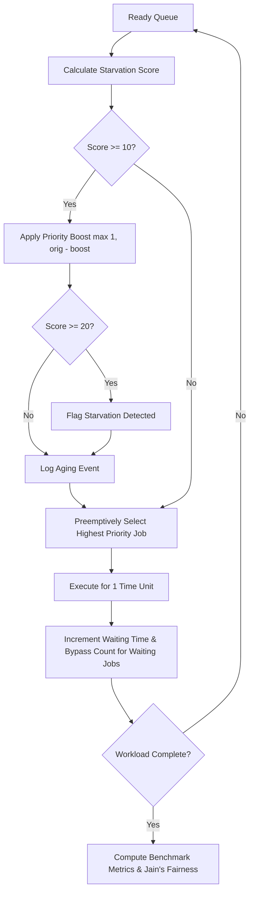

# StarveGuard

### Adaptive Process Starvation Detection and Aging-Based Prevention System

**StarveGuard** is an Operating Systems CPU scheduling research prototype that detects and prevents process starvation in preemptive priority scheduling. By tracking queue waiting times and scheduling bypass frequencies, StarveGuard computes a dynamic starvation score and applies multi-tier aging to guarantee forward progress for lower-priority jobs without sacrificing priority hierarchy.

---

## The Problem & The Solution

| Challenge in Standard Priority Scheduling | StarveGuard's Adaptive Solution |
| :--- | :--- |
| **Indefinite Starvation:** High-priority arrivals continually monopolize the CPU. | **Dual-Factor Tracking:** Continuously monitors both cumulative waiting time and scheduling bypass count. |
| **Static Priorities:** Low-priority tasks remain locked at their initial rank. | **Graduated Aging:** Dynamically escalates effective priority based on starvation severity. |
| **No Starvation Visibility:** Schedulers do not identify struggling processes. | **Explicit Detection:** Flags starvation when a process score reaches or exceeds threshold 20. |
| **Degraded Fairness:** System throughput becomes biased against longer/lower-priority tasks. | **Balanced Throughput:** Improves Jain's Fairness Index and cuts response times by up to 28%. |

---

## How It Works



### 1. Starvation Detection Formula
$$\text{Starvation Score} = \text{Waiting Time} + (\text{Bypass Count} \times 2)$$

- **Waiting Time:** Discrete time units spent in the ready queue.
- **Bypass Count:** Number of scheduling cycles where a process was ready but another process took the CPU.
- **Starvation Threshold:** When $\text{Score} \ge 20$, the process is marked as **Starved**.

### 2. Multi-Tier Aging Policy
Aging reduces the process's numerical priority value (**lower number = higher priority**), anchored to `original_priority` with a floor of `1`:

| Starvation Score | Priority Boost | Effective Priority Formula | Status |
| :---: | :---: | :--- | :--- |
| **0 – 9** | `0` | `current = original_priority` | Normal execution |
| **10 – 19** | `+1` | `current = max(1, original_priority - 1)` | Priority Escalation |
| **20 – 29** | `+2` | `current = max(1, original_priority - 2)` | **Starvation Flagged** |
| **30+** | `+3` | `current = max(1, original_priority - 3)` | Maximum Aging Tier |

---

## Architectural Comparison

| Dimension | Normal Priority Scheduler | StarveGuard Priority Scheduler |
| :--- | :---: | :---: |
| **Source Module** | `scheduler.normal_priority_scheduler` | `scheduler.priority_scheduler` |
| **Preemption** | Yes (per discrete time unit) | Yes (per discrete time unit) |
| **Priority State** | Static (Fixed throughout) | Dynamic (Adaptive aging applied per cycle) |
| **Bypass Tracking** | ❌ No | ✅ Yes (`bypass_count`) |
| **Starvation Detection** | ❌ No | ✅ Yes ($\text{Score} \ge 20$) |
| **Aging Interventions** | ❌ None | ✅ Multi-tier boost based on score tiers |
| **Event Auditing** | ❌ None | ✅ Timestamped log of old $\to$ new priorities & scores |
| **Fairness Evaluation** | Post-simulation | Post-simulation (Jain's Fairness Index) |

---

## Aging in Action: Demonstration Walkthrough

Consider a high-contention arrival pattern where three priority-3 jobs arrive while low-priority process P1 (priority 6) is waiting:

| Process | Arrival Time | Burst Time | Initial Priority |
| :---: | :---: | :---: | :---: |
| **P1** | 0 | 15 | 6 (Low) |
| **P2** | 0 | 5 | 3 (High) |
| **P3** | 5 | 5 | 3 (High) |
| **P4** | 10 | 5 | 3 (High) |

### Timeline Comparison

- **Normal Priority:**
  `[ P2 (0-5) ][ P3 (5-10) ][ P4 (10-15) ][ P1 (15-30) ]`
  *P1 is starved in the queue for 15 units until all higher-priority jobs complete.*

- **StarveGuard Adaptive Timeline:**
  `[ P2 (0-5) ][ P3 (5-10) ][ P1 (10-14) ][ P4 (14-19) ][ P1 (19-30) ]`
  *At $t=4$, P1 is boosted to priority 5. At $t=7$, starvation is detected and P1 is boosted to priority 4. At $t=10$, P1 reaches score 30 and is boosted to **priority 3**. Having arrived earlier ($t=0$ vs $t=10$), **P1 preempts P4**!*

### Measured Outcome

| Metric | Normal Priority | StarveGuard | Impact |
| :--- | :---: | :---: | :--- |
| **Average Response Time** | 3.75 | **3.50** | **-6.7% (Faster first CPU allocation)** |
| **Average Waiting Time** | 3.75 | 4.75 | Minimal trade-off (+1.00) to break starvation |
| **Maximum Waiting Time** | 15 | 15 | Maintained |
| **Starved / Protected** | 0 / 0 | **1 / 2** | Successfully prevented prolonged lockout |
| **Aging Interventions** | 0 | **4** | Dynamic priority adjustments executed |

---

## Experimental Benchmark Results

From the automated test suite (`results/workload_results.csv`):

| Workload | Scenario Description | Normal Resp | StarveGuard Resp | Normal Fairness | StarveGuard Fairness | Aging Events |
| :--- | :--- | :---: | :---: | :---: | :---: | :---: |
| **Workload 1** | Classic Starvation (P1:20 vs P2,P3) | 15.00 | **11.67 (-22.2%)** | 0.583 | **0.630 (+8.1%)** | 7 |
| **Workload 2** | Staggered Mixed Arrivals | 5.25 | 5.25 | 0.765 | 0.765 | 7 |
| **Workload 3** | Long-Burst Starvation (P1:30 vs P2,P3) | 23.33 | **16.67 (-28.5%)** | 0.636 | **0.672 (+5.7%)** | 7 |
| **Workload 4** | Sequential Arrivals (No Contention) | 0.00 | 0.00 | 1.000 | 1.000 | 0 |

> **Key Finding:** In contested environments, StarveGuard dramatically reduces response times (by up to **28.5%**) and improves Jain's Fairness Index while matching baseline behavior identically when contention is absent.

---

## Metrics & Mathematical Foundations

StarveGuard calculates performance and equity through `metrics/calculator.py`:

- **Jain's Fairness Index:** Evaluates system service efficiency across processes:
  $$J(x_1, \dots, x_n) = \frac{\left(\sum_{i=1}^n x_i\right)^2}{n \cdot \sum_{i=1}^n x_i^2}, \quad x_i = \frac{\text{Burst}_i}{\text{Turnaround}_i}$$
  *(1.0 denotes perfect fairness; lower values reflect starvation imbalance).*
- **Average Waiting Time:** Mean duration processes spent in the ready queue: $\frac{1}{n} \sum WT_i$.
- **Average Turnaround Time:** Mean elapsed time from arrival to completion: $\frac{1}{n} \sum TAT_i$.
- **Average Response Time:** Mean time from arrival to initial CPU dispatch: $\frac{1}{n} \sum RT_i$.
- **Process Lifecycle Relations:**
  - $\text{Turnaround Time} = \text{Completion Time} - \text{Arrival Time}$
  - $\text{Waiting Time} = \text{Turnaround Time} - \text{Burst Time}$
  - $\text{Response Time} = \text{First Run Time} - \text{Arrival Time}$

---

## Desktop Dashboard & CLI

### Graphical Interface (`ui/app.py`)
Built with Tkinter and ttk, the dashboard includes:
- **Interactive Process Table:** Configure arrivals, bursts, and priorities for P1–P4 with Enter-key navigation.
- **Side-by-Side Metrics Panels:** Live numerical comparison across Normal, StarveGuard, and signed delta changes.
- **Dual Visual Gantt Charts:** Proportional Tkinter Canvas timelines showing exact execution intervals and idle periods.
- **Process & Event Treeviews:** 12-column process-level detail table alongside a chronological aging event log.
- **Benchmark Graph Viewer:** Launch comparative Matplotlib visualizations (`waiting`, `response`, and `fairness`).

### Command-Line Interface (`main.py`)
An interactive terminal runner that executes both schedulers, prints ASCII Gantt charts, displays comparative metric tables, and outputs the aging audit log.

---

## Project Structure

```
StarveGuard/
├── aging/          # Multi-tier priority boost and aging manager
├── comparison/     # SchedulerComparator running dual simulations
├── metrics/        # MetricsCalculator and Jain's Fairness Index
├── results/        # Pre-generated benchmark CSV logs and Matplotlib charts
├── scheduler/      # Process dataclass, priority scheduler, and normal scheduler
├── starvation/     # StarvationDetector scoring and threshold checks
├── tests/          # 11 unit and integration test suites
├── ui/             # Tkinter desktop application (app.py)
├── main.py         # Terminal CLI runner
└── README.md       # Project documentation
```

---

## Getting Started

### 1. Prerequisites & Installation
Requires **Python 3.10+** (uses standard libraries `tkinter`, `dataclasses`, `csv`).

```bash
git clone https://github.com/ujvall/StarveGuard.git
cd StarveGuard

# Optional (only needed for generating standalone graph PNGs):
pip install matplotlib
```

### 2. Launching the GUI Dashboard
```bash
python ui/app.py
```
*Click **Load Demo Workload** then **Run Simulation** to see aging-induced priority reversal in real time.*

### 3. Running via CLI
```bash
python main.py
```

### 4. Running the Benchmark Suite
```bash
python -m tests.test_workloads
```

---

## Limitations & Future Work

- **Static Parameters:** Fixed starvation threshold (`20`) and bypass weight (`2`) could be adapted dynamically to queue depth.
- **Discrete Simulation:** Single-time-unit simulation model rather than an interrupt-driven kernel scheduler.
- **Uniprocessor Scope:** Current model focuses on single-core scheduling; multi-core load balancing remains a future research avenue.

---

## Technology Stack & Author

| Component | Technology |
| :--- | :--- |
| **Core Algorithms** | Python 3 (Standard Library) |
| **Desktop GUI** | Tkinter / ttk (Canvas Gantt charts, Treeviews) |
| **Data & Plotting** | CSV, Matplotlib |

**Author:** [Ujval Sai](https://github.com/ujvall)  
**Repository:** [https://github.com/ujvall/StarveGuard](https://github.com/ujvall/StarveGuard)  
*Academic Operating Systems simulation prototype for priority scheduling starvation mitigation.*
